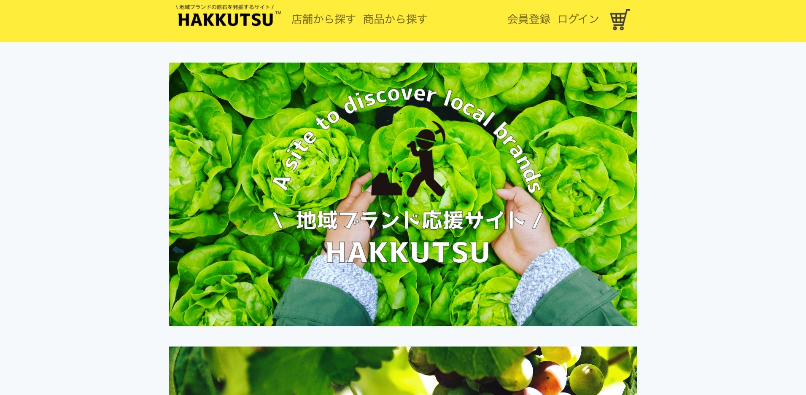

# HAKKUTSU
　地域ブランドを原石を発掘するECモール【hakkutsu】です。 
　まだブランド展開までできてないものの、良いものを作れている地域の生産者はたくさんいます。その生産者に簡単に直販できるプラットフォームとして開発しました。

## デモ

http://hakkutsu-ec.herokuapp.com/

## 機能

* カート機能
* 送付先追加機能
* 注文機能
* 決済機能
* 注文履歴確認機能
* ログイン機能
* ユーザ登録（編集・削除）
* 店舗登録（編集・削除）
* 商品登録（編集・削除）
* 商品レビュー機能

## 環境

フロントエンド
* HTML5
* CSS3
* Bootstrap4

サーバーサイド
* php7.2
* laravel5.8

インフラ
* CentOS-7/3
* VirtualBox
* Vagrant
* docker
* apache 2.4.6
* mysql 5.7
* phpMyAdmin
* stripe
* heroku
* aws-s3

## 作成者

開発
* SHUN
* MASARU
* RYOTA
 

講師
* YUYA
* YUKIHIRO

